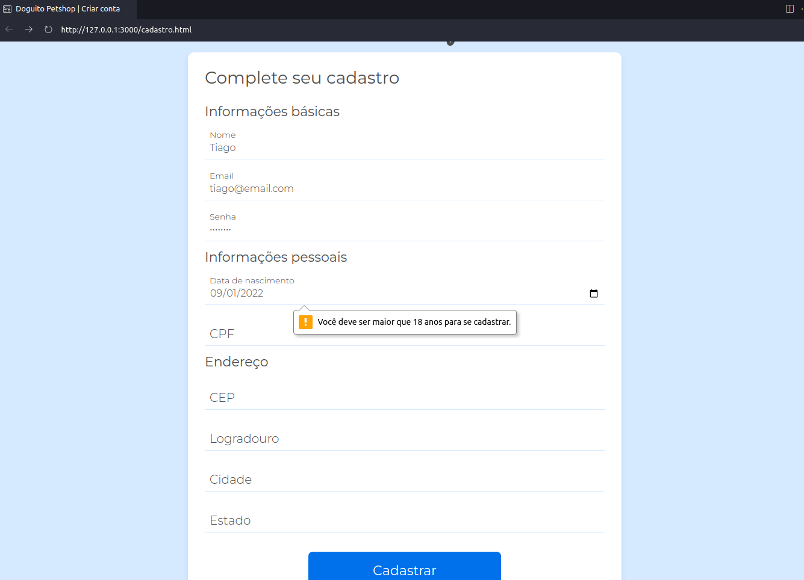

## Curso de JavaScript na Web: validação de Formulários e HTML5

Faça esse curso de JavaScript e:

- Valide formulários utilizando as ferramentas do próprio HTML5

- Crie suas próprias validações customizadas utilizando técnicas atuais com JavaScript

- Aprenda como preencher campos de endereço automaticamente com requisições à API da ViaCEP

- Aplique uma máscara monetária em campos de preço

**Instrutor:** Matheus Alberto

:octocat:	
[GitHub](https://github.com/ikyrie)

__________

GitHub Pages:

[Acessem]()

### 01. Validação com HTML 

**Início do projeto**

*Regex para senhas*

[Regex lib](https://regexlib.com/Search.aspx?k=password&AspxAutoDetectCookieSupport=1)

Regex: ^(?=.*[a-z])(?=.*[A-Z])(?=.*[0-9])(?!.*[ !@#$%^&*_=+-]).{6,12}$ 

**pattern="^(?=.*[a-z])(?=.*[A-Z])(?=.*[0-9])(?!.*[ !@#$%^&*_=+-]).{6,12}$"**

**Treinar escrita de regex**

[Treinar escrita de regex](https://regexr.com/)

**Nesta aula, aprendemos:**

- Fazer validações no próprio HTML utilizando os atributos **required** e **type**.

- Usar regras de regex dentro do atributo **pattern** para validar o campo de senha.

- Mandar uma mensagem customizada de erro no balão do navegador.

### 02. Validações customizadas

**Validar data de nascimento**

**Cadastro feito | Validar data de nascimento**

**Nesta aula, aprendemos:**

- Criar funções para validações customizadas do formulário

- Definir mensagens customizadas para validações fora do HTML

- Utilizar data attributes para trabalhar com JavaScript

- Deixar a função de validação mais genérica para funcionar com qualquer **input**

### 03. Mensagens customizadas 

**Browser servers**

npm install -g browser-sync 

Na raiz do projeto 

browser-sync start -s -f . --directory

**Customizados as mensagens de erro**

**Mensagem de Erro E-mail** 

**Mensagem de Erro Senha**

**Nesta aula, aprendemos:**

- A instalar e usar o plugin Liveserver

- Como baixar e rodar o browser-sync

- Como mostrar a mensagem de erro diretamente no HTML

- Como customizar as mensagens de erro de validação

### 04. Validando CPF

**Validando CPF com números repetidos | ERRO**

**Validando CPF com números repetidos | CERTO**

**Nesta aula, aprendemos:**

- A validar cpf com números repetidos

- A matemática por trás da validação de um CPF

- Recursão de função

### 05. Conectando com a API Via CEP

**Nesta aula, aprendemos:**

- Outra estrutura de regex para a pré validação do CEP

- Como fazer uma requisição para a API da ViaCEP

- Preencher outros campos do formulário com a resposta da API da ViaCEP

### 04. Aplicação de máscara

**simple-mask-money**

[simple-mask-money](https://github.com/codermarcos/simple-mask-money)

**Aplicação de máscara**

**Nesta aula, aprendemos:**

- Como adicionar máscara monetária para o campo de preço.

